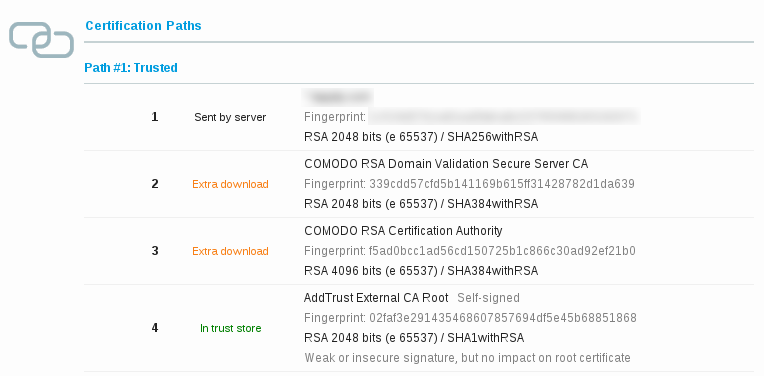

# SSL certificate chain resolver

This tool can help you fix the *incomplete certificate chain* issue, also reported as *Extra download* by [Qualys SSL Server Test](https://www.ssllabs.com/ssltest/).

## Usage

Dependencies:

- OpenSSL
- curl

```
./resolve.sh input.pem output.pem
```

All certificates are in Base64-encoded PEM format.

Example:

```
$ grep -C 1 'CERTIFICATE' input.pem
-----BEGIN CERTIFICATE-----
MIIFSzCCBDOgAwIBAgIQMT4Uwi0nWHXk9Ww81+gXlzANBgkqhkiG9w0BAQsFADCB
--
SZZbFEwO75QSDeeEzRdX
-----END CERTIFICATE-----

$ ./resolve.sh input.pem output.pem
1: OU=Domain Control Validated, OU=PositiveSSL Wildcard, CN=*.xxx.com
2: C=GB, ST=Greater Manchester, L=Salford, O=COMODO CA Limited, CN=COMODO RSA Domain Validation Secure Server CA
3: C=GB, ST=Greater Manchester, L=Salford, O=COMODO CA Limited, CN=COMODO RSA Certification Authority

Certificate chain complete.
Total 3 certificate(s) written.

$ grep -C 1 'CERTIFICATE' output.pem
-----BEGIN CERTIFICATE-----
MIIFSzCCBDOgAwIBAgIQMT4Uwi0nWHXk9Ww81+gXlzANBgkqhkiG9w0BAQsFADCB
--
SZZbFEwO75QSDeeEzRdX
-----END CERTIFICATE-----
-----BEGIN CERTIFICATE-----
MIIGCDCCA/CgAwIBAgIQKy5u6tl1NmwUim7bo3yMBzANBgkqhkiG9w0BAQwFADCB
--
+AZxAeKCINT+b72x
-----END CERTIFICATE-----
-----BEGIN CERTIFICATE-----
MIIFdDCCBFygAwIBAgIQJ2buVutJ846r13Ci/ITeIjANBgkqhkiG9w0BAQwFADBv
--
pu/xO28QOG8=
-----END CERTIFICATE-----
```

## Description



All operating systems contain a set of default trusted root certificates. But CAs usually don't use their root certificate to sign customer certificates. Instead of they use so called intermediate certificates, because they can be rotated more frequently.

A certificate can contain a special *Authority Information Access* extension ([RFC-3280](http://tools.ietf.org/html/rfc3280)) with URL to issuer's certificate. Most browsers can use the AIA extension to download missing intermediate certificate to complete the certificate chain. This is the exact meaning of the *Extra download* message. But some clients (mobile browsers, OpenSSL) don't support this extension, so they report such certificate as untrusted.

A server should always send a complete chain, which means concatenated all certificates from the certificate to the trusted root certificate (exclusive, in this order), to prevent such issues. Note, the trusted root certificate should not be there, as it is already included in the system’s root certificate store.

You should be able to fetch intermediate certificates from the issuer and concat them together by yourself, this tool helps you automatize it by looping over certificate's AIA extension field.

## TODO

- A public web service to make it available to more users (Windows, non-IT)
